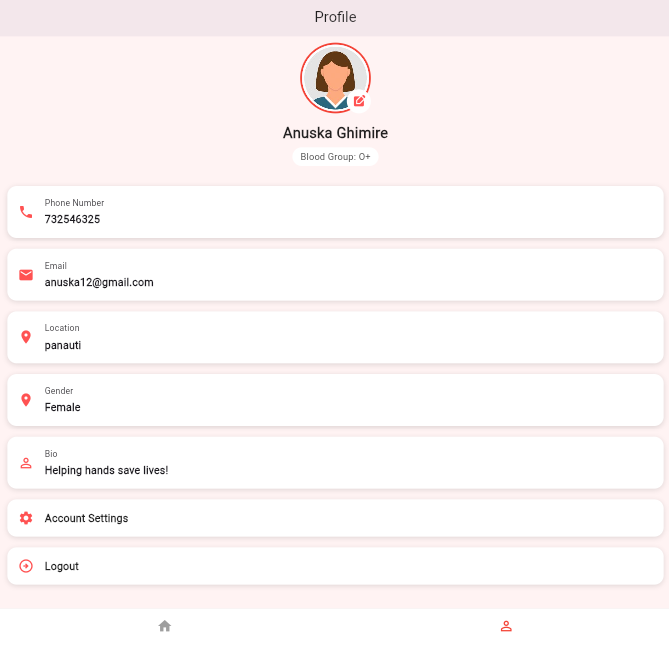

# Blood Donation App

The Blood Donation App is a Flutter-based mobile application designed to help manage blood donor information and make it easier to find suitable blood donors.

This application allows users to register, log in, and add blood donor details. Users can view a list of available donors and search for donors based on blood group. The main goal of the app is to simplify the process of managing blood donation data in a simple and user-friendly way.

---

## Features
- User registration
- User login
- Add blood donor details
- View list of blood donors
- Search donors by blood group
- Clean and simple user interface

---

## Technologies Used
- Flutter
- Dart
- Firebase (if used)
- Android Studio / VS Code

---

## Screenshots

---

## How to Run the Project
1. Clone the repository  
   git clone https://github.com/your-username/blooddonation.git

2. Open the project in VS Code or Android Studio

3. Run the following commands  
   flutter pub get  
   flutter run

---

## Developer
Anuska Ghimire
